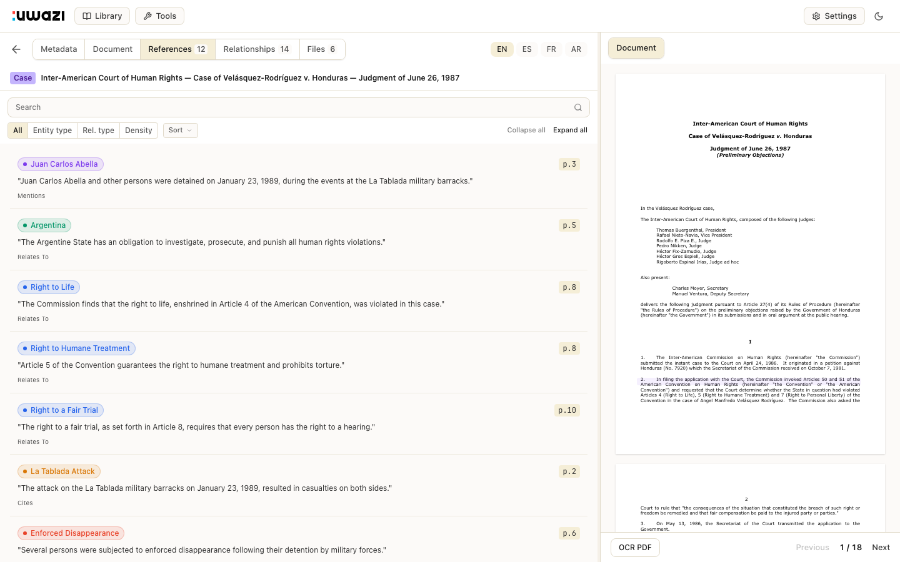

# Uwazi 2026

Design system, screens, and interactive prototype for the Uwazi settings/admin UI redesign.

## Figma

All screens and the design system live in a single Figma file:

**[Uwazi v3 — Screens](https://www.figma.com/design/5VSISGr1dSEKi1dGG5Noft)**

| Page | Contents | Link |
|------|----------|------|
| Design System | 43 components, color/dimension variables, text styles, effect styles | [Open](https://www.figma.com/design/5VSISGr1dSEKi1dGG5Noft?node-id=40-2) |
| Import CSV | 8 screens: Empty State, List, List Selected, Modal, Detail (Completed, Processing, Failed, Warnings) | [Open](https://www.figma.com/design/5VSISGr1dSEKi1dGG5Noft?node-id=0-1) |
| Entity View | 10 screens: Document, References, Relationships, Files (Card/Table/Selected/Multi-select/Translations/No Selection), Audio | [Open](https://www.figma.com/design/5VSISGr1dSEKi1dGG5Noft?node-id=29-2) |
| Reference Screenshots | Prototype screenshots for pixel-perfect reference | [Open](https://www.figma.com/design/5VSISGr1dSEKi1dGG5Noft?node-id=84-2) |

### Token System

- **Colors** — 26 variables with Light/Dark modes (backgrounds, text, borders, accents, semantic, highlights)
- **Dimensions** — 28 variables (spacing scale, border radii, component sizes)
- **Text Styles** — 14 styles (Heading XL–SM, Body LG–XXS, Label LG–XS, Caption)
- **Effect Styles** — 8 styles (Shadow SM–XL, Modal, Dropdown, Card, Tabs)

All components are bound to variables — switching a frame to Dark mode updates colors automatically.

## Structure

```
.
├── app/                           # Interactive prototype (Vite + React 18 + TS + Tailwind v4 + Jotai)
│   ├── src/
│   │   ├── atoms/                 # Jotai state (navigation, references, selection, filters, theme, language)
│   │   ├── components/
│   │   │   ├── layout/            # Navbar, SplitView, MainTabs, DrawerTabs, Breadcrumb, ToolsSidebar, ToolsActionBar
│   │   │   ├── viewer/            # DocumentViewer, PageHighlights, FloatingMenu, ActionBar
│   │   │   ├── references/        # ReferencePanel, RefRow, FilterBar, SearchBar, GroupedCard, DensityCard
│   │   │   ├── files/             # FileTable, FileDrawer
│   │   │   ├── metadata/          # MetadataCard
│   │   │   ├── import-csv/        # ImportCSVLayout, ImportListView, ImportDetailView, ImportTable, IssuesTable, ImportEmptyState, NewImportModal
│   │   │   ├── shared/            # ConfirmDialog, UwaziLoader, StatusBadge, ProgressBar, StatsCard, Stepper, AlertBanner, EntityPill, PageTag, CountBadge
│   │   │   └── catalog/           # CatalogEntry, StyleGuide
│   │   ├── data/                  # Mock data (entities, documents, references, files, metadata, toc, imports)
│   │   └── views/                 # Page-level orchestrators (ReferencesView, FilesView, MetadataView, ImportCSVView, ComponentCatalog)
│   └── public/                    # Static assets (sample.pdf, logos)
├── images/                        # Logos, screenshots, assets
│   └── screens/                   # Prototype screenshots (prototype/ + import_csv/)
├── ui/                            # Legacy design files
│   └── archive/pen-originals/     # Archived .pen files (Pencil format)
├── docs/                          # Rebrand guides & design documentation
└── README.md
```

## Prototype

Interactive frontend for testing layout, navigation, and interaction patterns. All mock data, no backend.

### Quick start

```bash
cd app
npm install
npm run dev        # → http://localhost:5173
```

### Conventions

- **Units** — `rem` for layout dimensions. Tailwind spacing utilities are fine (they output `rem`). Reserve `px` for borders, shadows, sub-pixel details.
- **Colors** — All via CSS custom properties in `tokens.css`, mapped to Tailwind in `index.css`. Dark mode comes free — never hardcode hex values.
- **State** — Jotai atoms for cross-component state, local `useState` for view-scoped UI.

### Navigation

- **Library** (default) — Entity viewer with document, metadata, references, relationships, and files tabs
- **Tools > Import CSV** — Full import lifecycle with sidebar, list/detail screens, and upload simulation
- **Logo click** — Toggles to/from the component catalog

## Branding

### Logo & Icons

| Asset | Preview | File |
|---|---|---|
| Wordmark |  | `images/nu-logo.png` / `.svg` |
| App icon (dark) |  | `images/icon.png` |
| App icon (light) |  | `images/icon-white.png` |
| Symbol |  | `images/logo_sym.png` |

Navbar wordmark: **73 x 18**. Wordmark is the default — symbol only where space is constrained. Seal square always above Carbon.

### Palette

| Name | Hex | Role |
|---|---|---|
| Ink | `#1A1A1A` | The letterpress — text, headers, primary buttons |
| Seal | `#E8432A` | The stamp — danger, alerts, destructive actions |
| Carbon | `#00B4F0` | The copy — links, data, processing states |
| Vellum | `#F5EED7` | Warm stock — muted backgrounds, hover states |
| Parchment | `#F5F0E8` | Cool stock — page grounds |
| Paper | `#FFFFFF` | The margin — cards, modals, open space |

## Screenshots

### Entity View

| Document viewer | Files (selected) |
|---|---|
|  |  |

| References | Dark mode |
|---|---|
|  |  |

### Import CSV

| List | Detail (Completed) |
|---|---|
|  |  |

| Empty State | Modal |
|---|---|
|  |  |

---

*Uwazi Design Team*
