# Uwazi 2026

Design system, screens, and interactive prototype for the Uwazi settings/admin UI redesign.

## Setup — Pencil

`.pen` files are edited with [Pencil](https://pencil.dev), a design canvas that runs inside your IDE.

### Install the extension

1. Open **VS Code** or **Cursor**
2. Go to Extensions (`Cmd + Shift + X`)
3. Search for **"Pencil"** → Install
4. Create or open any `.pen` file — look for the Pencil icon in the top-right editor corner

### AI features (optional)

Pencil exposes an MCP server that AI coding agents can use to read and write `.pen` files. It connects automatically — no extra config needed. Check your IDE's MCP/tools settings to verify Pencil is listed.

## Structure

```
.
├── ui/                         # All design files (.pen)
│   ├── entity-view/            # Entity viewer screens
│   ├── library/                # Library & search
│   ├── tools/                  # Admin tools (import CSV, activity log, etc.)
│   ├── settings/
│   │   ├── user/               # User preferences
│   │   └── system/             # System configuration
│   └── archive/                # Previous iterations
├── app/                        # Interactive prototype (Vite + React + TS + Tailwind v4)
│   ├── src/
│   │   ├── atoms/              # Jotai state (navigation, references, selection, filters, theme, language)
│   │   ├── components/
│   │   │   ├── layout/         # Navbar, SplitView, MainTabs, DrawerTabs, Breadcrumb, ToolsSidebar, ToolsActionBar
│   │   │   ├── viewer/         # DocumentViewer, PageHighlights, FloatingMenu, ActionBar
│   │   │   ├── references/     # ReferencePanel, RefRow, FilterBar, SearchBar, GroupedCard, DensityCard
│   │   │   ├── files/          # FileTable, FileDrawer
│   │   │   ├── metadata/       # MetadataCard
│   │   │   ├── import-csv/     # ImportCSVLayout, ImportListView, ImportDetailView, ImportTable, IssuesTable, ImportEmptyState, NewImportModal
│   │   │   ├── shared/         # ConfirmDialog, UwaziLoader, StatusBadge, ProgressBar, StatsCard, Stepper, AlertBanner, EntityPill, PageTag, CountBadge
│   │   │   └── catalog/        # CatalogEntry, StyleGuide
│   │   ├── data/               # Mock data (entities, documents, references, files, metadata, toc, imports)
│   │   └── views/              # Page-level orchestrators (ReferencesView, FilesView, MetadataView, ImportCSVView, ComponentCatalog)
│   └── public/                 # Static assets (sample.pdf, logos)
├── images/                     # Shared assets (referenced by .pen files)
├── docs/                       # Rebrand guides & design documentation
└── README.md
```

## Screens

| Section | File | Screens |
|---|---|---|
| Entity View | `ui/entity-view/entity-view.pen` | Document, Files (Table, Split Selected, Split Supporting, Split Multi, Table Selected, Table Multi-select), drawer |
| Import CSV | `ui/tools/import-csv.pen` | Empty State, New Import Modal (3 states), List, List Selected, Detail, Detail Uploading, Detail Processing, Detail Failed, Detail Warnings, Detail Mixed |

## Branding

### Logo & Icons

| Asset | Preview | File |
|---|---|---|
| Wordmark |  | `images/nu-logo.png` / `.svg` |
| App icon (dark) |  | `images/icon.png` |
| App icon (light) |  | `images/icon-white.png` |
| Symbol |  | `images/logo_sym.png` |

Navbar wordmark: **73 x 18**. Wordmark is the default — symbol only where space is constrained. Seal square always above Carbon.

### Palette

| Name | Hex | Role |
|---|---|---|
| Ink | `#1A1A1A` | The letterpress — text, headers, primary buttons |
| Seal | `#E8432A` | The stamp — danger, alerts, destructive actions |
| Carbon | `#00B4F0` | The copy — links, data, processing states |
| Vellum | `#F5EED7` | Warm stock — muted backgrounds, hover states |
| Parchment | `#F5F0E8` | Cool stock — page grounds |
| Paper | `#FFFFFF` | The margin — cards, modals, open space |

## Prototype

Interactive frontend for testing layout, navigation, and interaction patterns. Vite + React 18 + TypeScript + Tailwind v4 + Jotai. All mock data, no backend.

### Quick start

```bash
cd app
npm install
npm run dev        # → http://localhost:5173
```

### Navigation

The prototype has three top-level views controlled by the navbar:

- **Library** (default) — Entity viewer with document, metadata, references, relationships, and files tabs
- **Tools > Import CSV** — Full import lifecycle with sidebar, list/detail screens, and upload simulation
- **Logo click** — Toggles to/from the component catalog

### Views

| Document viewer | Metadata |
|---|---|
| 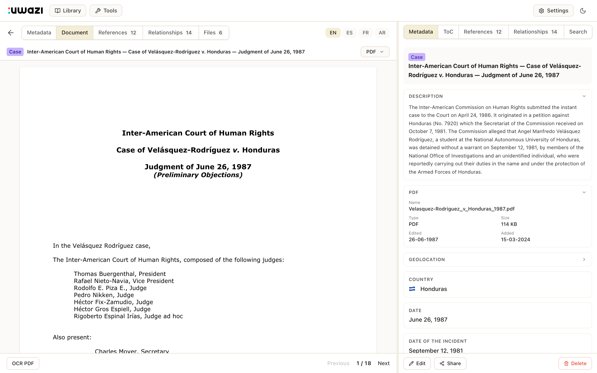 | 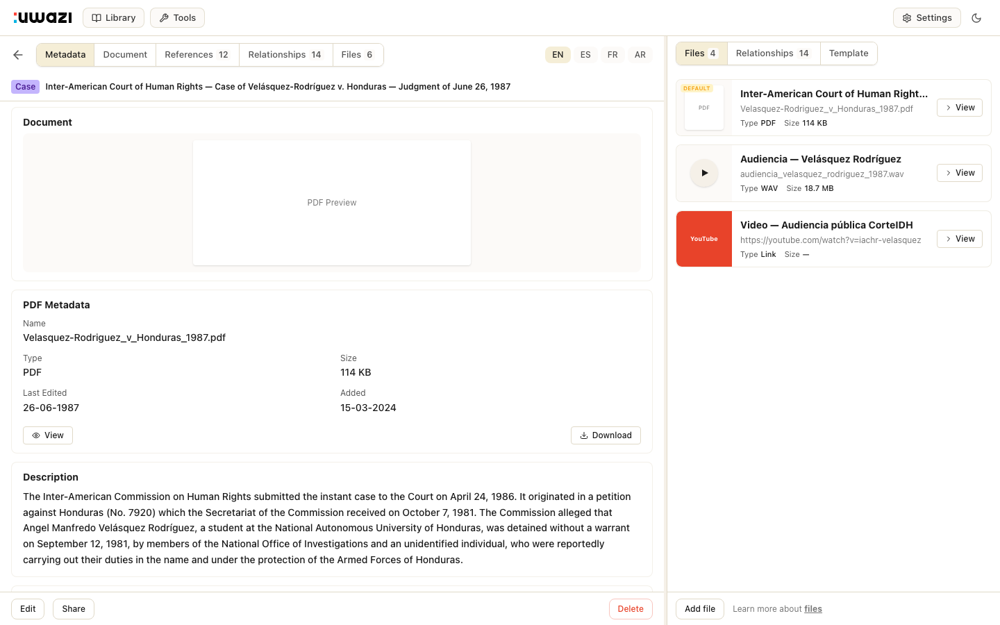 |

| Files (selected) | Dark mode |
|---|---|
| 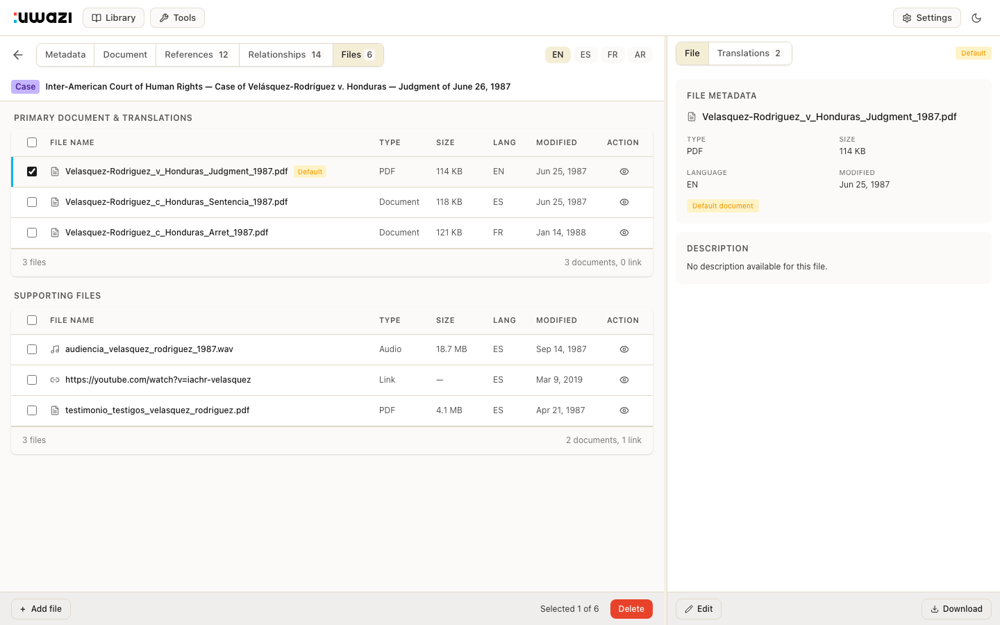 | 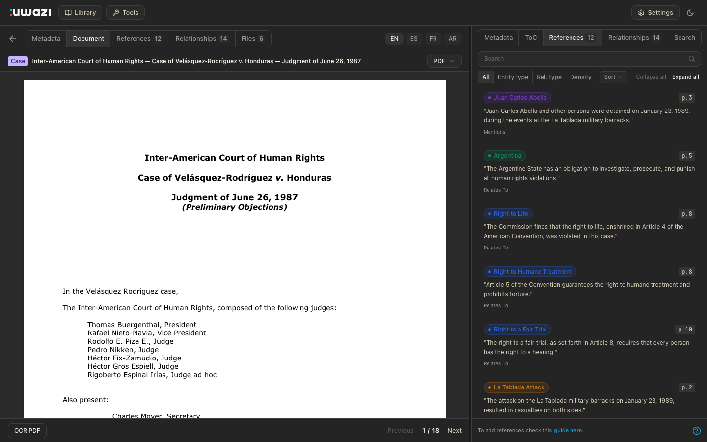 |

| Document + drawer | Component catalog |
|---|---|
|  | 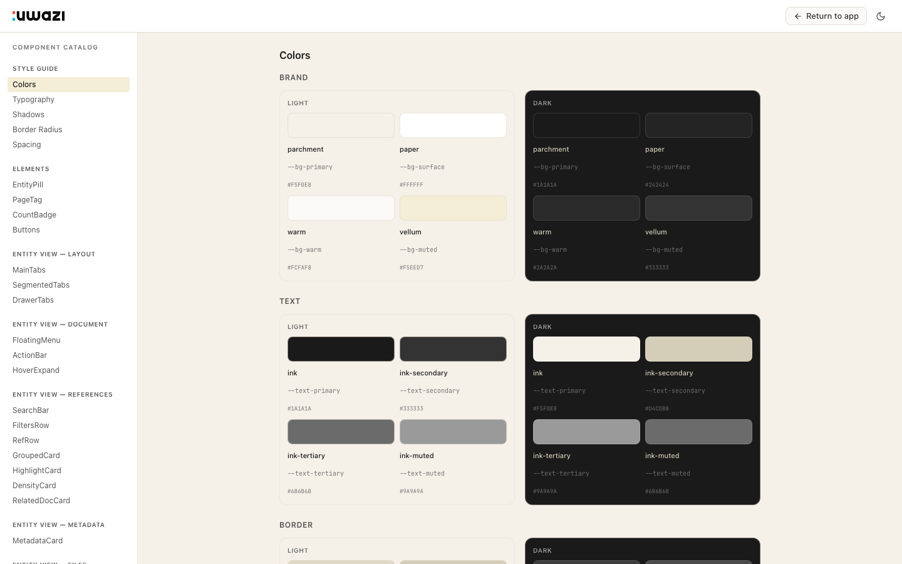 |

### Close-ups

| Highlights + drawer | Dark mode split |
|---|---|
| 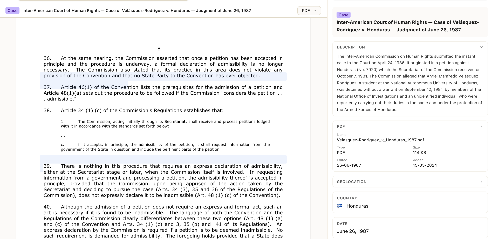 | 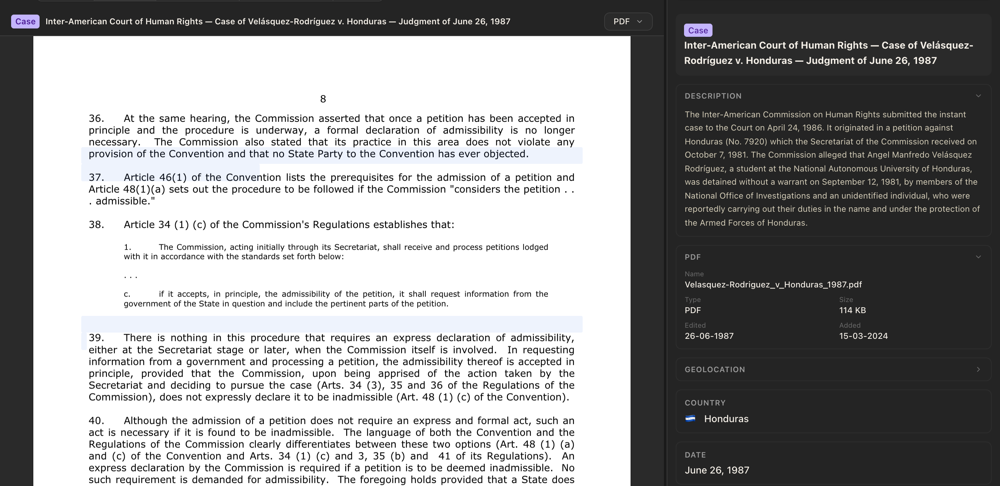 |

| Metadata cards | File cards |
|---|---|
| 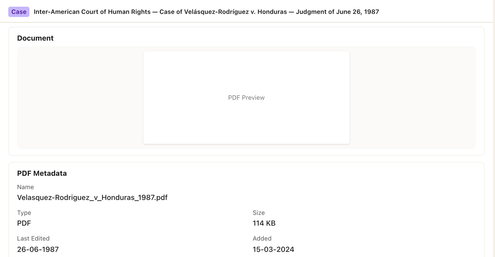 | 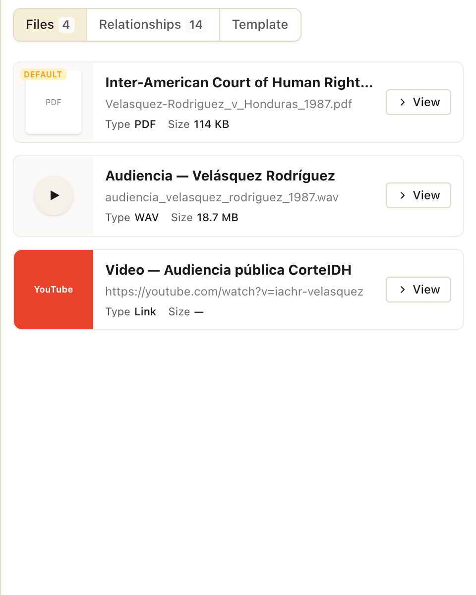 |

| Metadata drawer | Dark mode drawer |
|---|---|
|  | 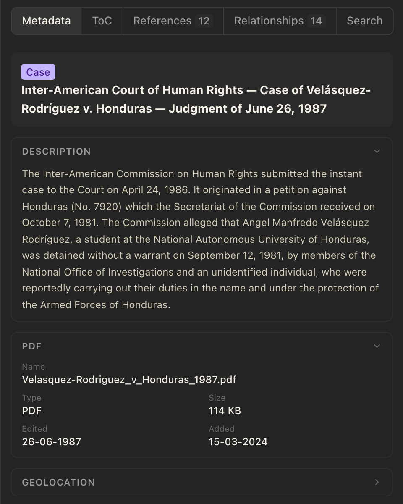 |

| Navbar | Navbar (dark) |
|---|---|
|  | 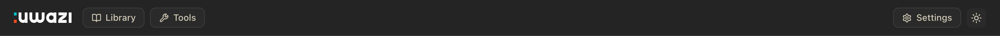 |

| Tab bar + language badges | Entity bar |
|---|---|
| 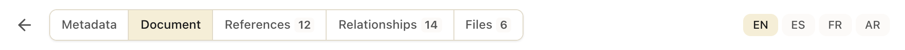 | 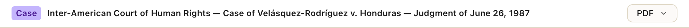 |

| Page navigation |
|---|
| 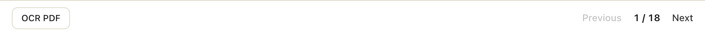 |

### Features

#### Entity View
- **Document viewer** — PDF rendering with continuous scroll, responsive scaling (ResizeObserver), page navigation, OCR button
- **Text References** — per-line highlight overlays with entity-type color coding, entity name tags on hover, floating menu on text selection, entity picker modal, bidirectional navigation (highlight ↔ RefRow), delete with confirmation
- **Reference panel** — search, sort (None/A→Z/Z→A), filter toggles (All/Entity type/Rel. type/Density), grouped cards with collapse/expand all, stacked density chart
- **Metadata** — read mode with property cards (description, country with flag, dates, type, mechanism, signatories), edit mode with inputs/textareas/checkboxes/country picker
- **Files** — dual tables (primary + translations, supporting), row selection with blue accent, file metadata drawer, compact stacked cards on multi-select, bulk actions
- **Translations drawer** — per-language file cards with Download all/Delete
- **Table of Contents** — collapsible tree (4 levels), ML-generated indicator, Edit + Mark as reviewed
- **Drawer tabs** — contextual per view: Metadata/ToC/References/Relationships/Search (document), File/Translations (files), Files/Relationships (metadata)

#### Import CSV
- **Tools sidebar** — 250px panel with Metadata (Templates, Extraction, Thesauri, Relationship Types) and Tools (Processes, Import CSV, Activity Log, Global CSS, Uploads) sections. Active item highlighted with blue left-border accent.
- **List view** — Stats bar (totals), sortable table with status badges, mini progress bars, checkbox selection with bulk delete
- **Detail view** — 6 states: completed (green progress + stats cards), uploading (stepper step 1 + animated blue bar), processing (stepper step 2 + animated blue bar), failed (red alert + error table), warnings (amber alert + warnings table), mixed errors+warnings (both alerts + combined issues table)
- **New Import modal** — Dropzone with click-to-upload, searchable template dropdown, three form states (empty → dropdown open → filled)
- **Upload simulation** — Animated progress: uploading → processing → completed, with random tick intervals and random outcome (clean or with warnings)
- **Empty state** — Upload icon + "No imports yet" CTA

#### Global
- **Dark mode** — CSS-variable-driven theme, toggled via navbar, persists to localStorage
- **RTL support** — Settings dropdown toggle, switches to Arabic, sets `dir="rtl"` on `<html>`
- **i18n** — Language toggle (EN/ES/FR/AR) updates all content in real time via Jotai
- **Shared components** — Toast notifications, entity pills, page tags, confirm dialogs, branded loader (UwaziLoader), status badges, progress bars, stats cards, stepper, alert banners
- **Component Catalog** — Click logo to browse all components with live previews and copyable code

---

*Uwazi Design Team*
