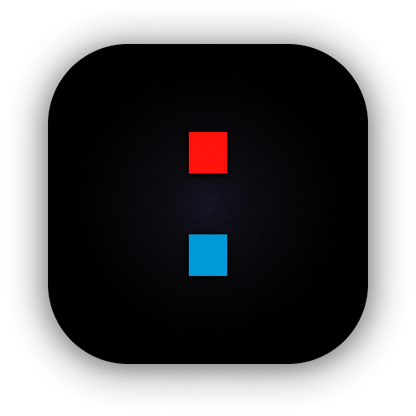
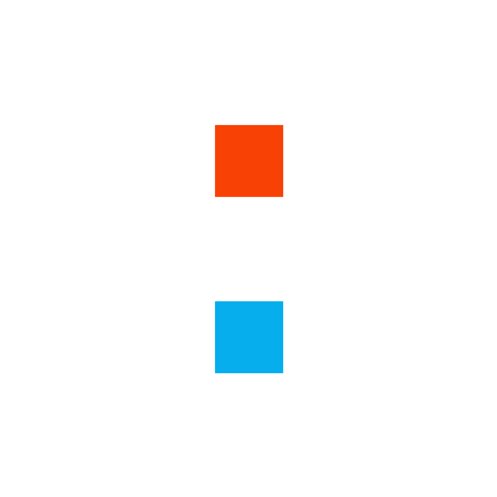

# Uwazi 2026

Design system, screens, and rebrand assets for Uwazi v2.

## Setup — Pencil

`.pen` files are edited with [Pencil](https://pencil.dev), a design canvas that runs inside your IDE.

### Install the extension

1. Open **VS Code** or **Cursor**
2. Go to Extensions (`Cmd + Shift + X`)
3. Search for **"Pencil"** → Install
4. Create or open any `.pen` file — look for the Pencil icon in the top-right editor corner

### AI features (optional)

Pencil exposes an MCP server that AI coding agents can use to read and write `.pen` files. It connects automatically — no extra config needed. Check your IDE's MCP/tools settings to verify Pencil is listed.

## Structure

```
.
├── ui/                         # All design files
│   ├── entity-view/            # Entity viewer screens
│   ├── library/                # Library & search
│   ├── tools/                  # Admin tools (import CSV, activity log, etc.)
│   ├── settings/
│   │   ├── user/               # User preferences
│   │   └── system/             # System configuration
│   └── archive/                # Previous iterations
├── app/                        # Lightweight frontend prototype (Vite + React)
│   ├── src/
│   │   ├── components/         # Layout, viewer, references, shared, catalog
│   │   ├── atoms/              # Jotai state (references, selection, filters)
│   │   ├── data/               # Mock entities, documents, references
│   │   └── views/              # Page-level views, modals, component catalog
│   └── public/                 # Static assets (sample.pdf, logos)
├── images/                     # Shared assets (referenced by .pen files)
├── docs/                       # Rebrand guides & design documentation
└── README.md
```

## Screens

| Section | File | Screens |
|---|---|---|
| Entity View | `ui/entity-view/entity-view.pen` | Document, Files (Table, Split Selected, Split Supporting, Split Multi, Table Selected, Table Multi-select), drawer |
| Import CSV | `ui/tools/import-csv.pen` | Empty State, New Import Modal (3 states), List, List Selected, Detail, Detail Uploading, Detail Processing, Detail Failed, Detail Warnings, Detail Mixed |

See [`docs/screens.md`](docs/screens.md) for full screen index with node IDs and layout details.

## Branding

### Logo & Icons

| Asset | Preview | File |
|---|---|---|
| Wordmark |  | `images/nu-logo.png` / `.svg` |
| App icon (dark) |  | `images/icon.png` |
| App icon (light) |  | `images/icon-white.png` |
| Symbol |  | `images/logo_sym.png` |

Navbar wordmark: **73 x 18**. Wordmark is the default — symbol only where space is constrained. Seal square always above Carbon.

### Palette

| Name | Hex | Role |
|---|---|---|
| Ink | `#1A1A1A` | The letterpress — text, headers, primary buttons |
| Seal | `#E8432A` | The stamp — danger, alerts, actions |
| Carbon | `#00B4F0` | The copy — links, data, processing |
| Vellum | `#F5EED7` | Warm stock — muted backgrounds, hover states |
| Parchment | `#F5F0E8` | Cool stock — page grounds |
| Paper | `#FFFFFF` | The margin — cards, modals, open space |

See [`docs/brand-colors.md`](docs/brand-colors.md) for full rebrand guide — variable mapping, accent usage, and design decisions.

## Prototype

Lightweight frontend for testing interactions. Vite + React 18 + TypeScript + Tailwind v4 + Jotai. All mock data, no backend.

### Quick start

```bash
cd app
npm install
npm run dev        # → http://localhost:5173
```

### Features

- **Layout** — navbar with logo + Library/Tools (left), Settings dropdown + dark mode toggle (right), main tabs (Metadata, Document, References, Relationships, Files), doc meta bar, language badges (EN/ES/FR/AR), resizable split view with contextual drawer
- **Dark mode** — CSS-variable-driven theme toggled via sun/moon button in navbar. `.dark` class on `<html>` swaps all tokens (backgrounds, text, borders, shadows, highlights, selection states, checkbox accents). Persists to localStorage.
- **RTL support** — test RTL layout via Settings dropdown toggle. Switches to Arabic content and sets `dir="rtl"` on `<html>`. Code blocks and monospace content stay LTR. Settings dropdown anchors right-aligned in LTR, left-aligned in RTL.
- **i18n** — language toggle (EN/ES/FR/AR) updates document title, metadata labels and values, PDF metadata, and drawer content in real time via Jotai atom
- **Metadata** — read mode with property cards (description, country with flag, dates, type, mechanism, signatories, other files), edit mode with inputs/textareas/checkboxes/country picker, PDF metadata card with View/Download. Drawer shows complete metadata with collapsible sections (description, PDF, geolocation, fields, other files)
- **Document viewer** — PDF rendering with continuous scroll, responsive container-aware scaling (ResizeObserver), page navigation (Previous/Next), OCR button
- **Text References** — per-line highlight overlays with entity-type color coding (subtle tint, hover/active/flash states), entity name tags on hover, floating menu on text selection, entity picker modal (search → relation type → create), bidirectional navigation (highlight click → opens References tab, collapses other groups, expands target group, scrolls to RefRow; RefRow click → navigates to page, flashes highlight), delete with confirmation
- **Reference panel** — search, sort (None/A→Z/Z→A), filter toggles (All/Entity type/Rel. type/Density), grouped cards with collapse/expand all, stacked density chart by relation type. References tab in main content shows full-width list with document viewer in drawer
- **Files management** — dual tables (primary document + translations, supporting files), row selection with blue accent, file metadata drawer, compact stacked cards on multi-select, bulk actions
- **Translations drawer** — per-language file cards (EN/ES/FR with file, AR empty state with dashed Add), Download all/Delete actions
- **Table of Contents** — collapsible tree with nested sections (up to 4 levels), page tags, Collapse All / Expand All, ML-generated indicator, Edit + Mark as reviewed actions
- **Drawer tabs** — contextual per view: Metadata/ToC/References/Relationships/Search (document), File/Translations (files), Files/Relationships (metadata), each with own action bar
- **Shared** — toast notifications (center top), entity pills, page tags, confirm dialogs, branded loader animation (UwaziLoader)
- **Component Catalog** — click logo to open storybook-like catalog with live previews, copyable React + Tailwind code blocks, style guide with separate light/dark color palettes, typography, shadows, radii, spacing, sidebar with scroll tracking

---

*Uwazi Design Team*
